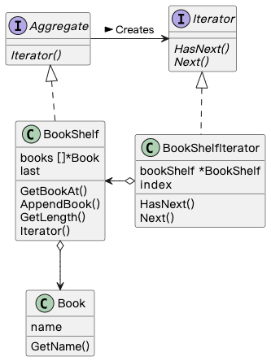

## Iterator 模式

> **迭代器** 是一种行为设计模式， 让你能在不暴露复杂数据结构内部细节的情况下遍历其中所有的元素。

### 示例程序类图

1. Iterator 接口：迭代器（Iterator），定义遍历元素的方法。
2. BookShelfIterator 类：具体的迭代器（ConcreteIterator），实现 Iterator 定义的方法。
3. Aggregate 接口：集合（Aggregate），定义创建 Iterator 的方法。
4. BookShelf 类：具体的集合（ConcreteAggregate），实现 Aggregate 定义的方法。

### 拓展思路的要点

1. Iterator 将遍历和实现分开，BookShelf 实现变化并不会影响遍历。
1. 使用 Aggregate 接口和 Iterator 接口，弱化类之间的耦合。
1. Aggregate 和 Iterator 是对应的，BookShelf 实现发生变化，BookShelfIterator 也需要变化。
1. 一个具体集合可以实现多个不同的 Iterator：从前往后遍历迭代器、从后往前遍历迭代器等等 。