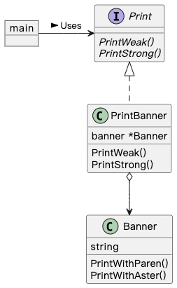

## Adapter 模式

有些现有程序无法直接使用，如需使用要做适当变换。这种填补 `现有程序` 和 `所需程序` 之间差异的设计模式就是 Adapter 模式（适配器模式）。

Adapter 模式有两种：

- 类适配器模式（使用继承的适配器，Golang 没有继承无法实现）
- 对象适配器模式（使用委托的适配器）

### 示例程序类图

### 拓展思路的要点

1. 类适配器模式：PrintBanner 继承 Banner 的两个方法来实现 Print 接口的方法；对象适配器模式：PrintBanner 将方法调用委派给 Banner 实例来实现 Print 接口的方法。
2. 我们调用的是 Print 接口的方法，Banner 类的两个方法被完全隐藏起来了。
3. 对于现有已充分测试，并被使用的类，可以使用 Adapter 模式进行复用或新增、修改功能。方便排查问题，避免重新进行测试。
4. 版本升级时，可以使用 Adapter 模式兼容新旧版本。