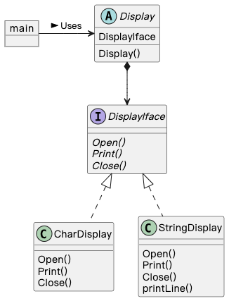

## Template Method 模式

在父类中定义处理流程的框架，在子类中实现具体处理的模式称为 Template Method 模式（模板方法模式）。

### 示例程序类图

Golang 没有继承，使用组合实现。

### 拓展思路的要点

1. 在父类模板方法中编写的算法，无需在子类中重复编写。
2. 需要理解父类中的抽象方法（Display()），才能够编写出子类（CharDisplay, StringDisplay）。
3. 父类变量保存子类实例，然后调用 Display()，无论哪个子类实例都能正常运行，符合 LSP（里氏替换原则）
