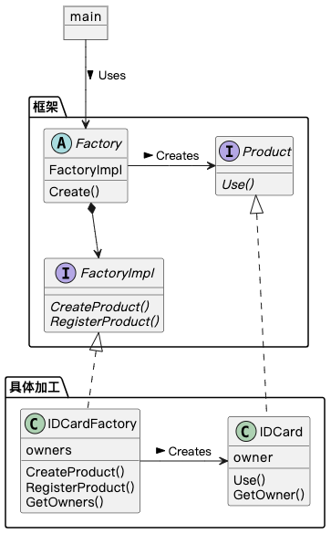

## Factory Method 模式

用 Template Method 模式（模板方法模式）来构建生成实例的工厂，就是 Factory Method 模式（工厂方法模式）。

### 示例程序类图

Golang 没有继承，使用组合实现。

### 拓展思路的要点

1. 父类只决定实例的生成方式（Create()），具体处理由子类负责（CreateProduct()、RegisterProduct()），解耦父类与具体类。
