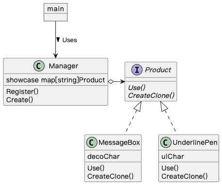

## Prototype 模式

> **原型** 是一种创建型设计模式， 使你能够复制对象， 甚至是复杂对象， 而又无需使代码依赖它们所属的类。

### 示例程序类图

1. Product 接口：原型（Prototype），定义用于复制实例的方法。
2. MessageBox 类、UnderlinePen 类：具体的原型（ConcretePrototype），实现复制实例的方法。
3. Manager 类：使用者（Client），使用复制实例的方法生成新实例。

### 拓展思路的要点

1. Manager 调用 Product 的 CreateClone() 复制实例，不关注具体复制的是哪一个类。解耦 Manager 与具体类。
2. 当对象种类繁多无法整合、难以根据类生成实例或想解耦框架与生成实例时，可以使用原型模式生成实例。
