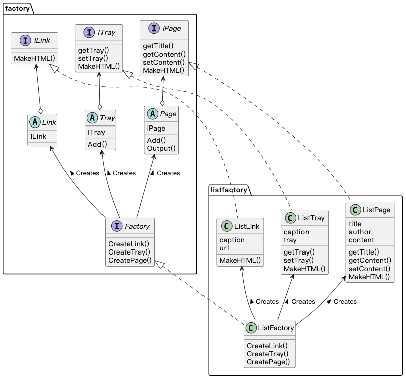

## Abstract Factory 模式

Abstract Factory 模式（抽象工厂模式）的工作是将 `抽象零件` 组装成 `抽象产品`。

### 示例程序类图

### 拓展思路的要点

1. 抽象工厂模式仅使用接口创建零件（CreateLink()、CreateTray()、CreatePage()）和组装零件（Add()），并不关心零件的具体实现。
2. （EASY）：新增具体工厂只需编写 4 个子类，分别实现 Factory、Ilink、ITray、IPage。
3. （HARD）：新增零件需要修改所有具体工厂。