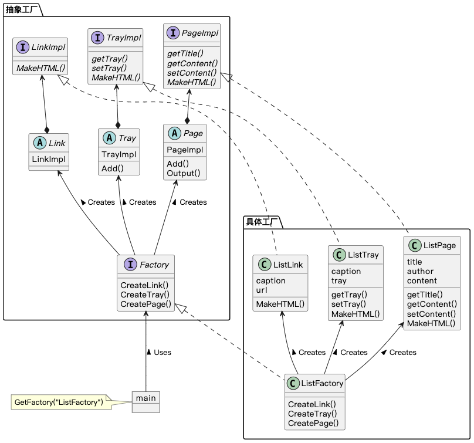

## Abstract Factory 模式

> **抽象工厂** 是一种创建型设计模式， 它能创建一系列相关的对象， 而无需指定其具体类。

### 示例程序类图

1. Link 抽象类、Tray 抽象类、Page 抽象类：抽象产品（AbstractProduct），定义 AbstractFactory 所生成的抽象产品及其方法。
2. Factory 接口：抽象工厂（AbstractFactory），定义用于生成抽象产品的方法。
3. ListLink 类、ListTray 类、ListPage 类：具体产品（ConcreteProduct），实现 AbstractProduct 定义的方法。
4. ListFactory 类：具体工厂（ConcreteFactory），实现 AbstractFactory 定义的方法。

5. main：委托者（Client），调用 AbstractFactory 和 AbstractProduct 的方法组装和使用产品。

### 拓展思路的要点

1. 抽象工厂模式仅使用接口创建产品（CreateLink()、CreateTray()、CreatePage()）和使用产品（Add()），并不关心产品的具体实现。
2. （EASY）：新增具体工厂只需编写 4 个子类，分别实现 Factory、linkImpl、TrayImpl、IPageImpl。
3. （HARD）：新增产品需要修改所有具体工厂。