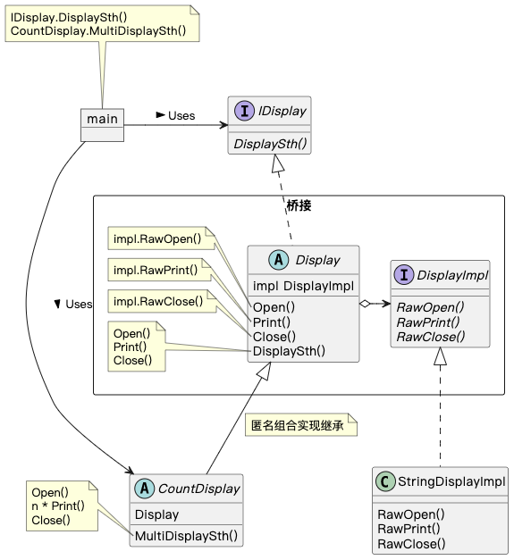

## Bridge 模式

Bridge 模式（桥接模式）的作用是将 **类的功能层次结构** 和 **类的实现层次结构** 连接起来。

类层次结构的作用：

1. 类的功能层次结构

   - 父类具有基本功能

   - 在子类中增加新的功能

2. 类的实现层次结构

   - 父类通过声明抽象方法来定义接口（API）

   - 子类通过实现具体方法来实现接口（API）

### 示例程序类图

1. `Display` 抽象类：抽象部分（Abstraction），抽象的最上层，定义基本功能。
2. `CountDisplay` 抽象类：改善后的抽象部分（RefinedAbstraction），在 Abstraction 的基础上增加功能。
3. `DisplayImpl` 接口：实现者（Implementor），实现的最上层，定义用于实现 Abstraction 功能的方法。
4. `StringDisplayImpl` 类：具体实现者（ConcreteImplementor），实现 Implementor 定义的方法。

`Display` 抽象类和 `CountDisplay` 抽象类是类的功能层次结构，`DisplayImpl` 接口和 `StringDisplayImpl` 类是类的实现层次结构，impl 是它们之间的桥梁。

### 拓展思路的要点

1. 将类的两个层次结构分离开更容易拓展，如增加功能时，无需修改实现。
2. `Display` 抽象类将方法委托给 DisplayImpl 实例实现，委托是弱关联，只需改变传入实例即可改变实现。
