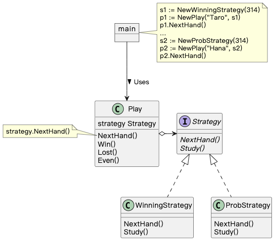

## Strategy 模式

> **策略** 是一种行为设计模式， 它将一组行为转换为对象， 并使其在原始上下文对象内部能够相互替换。

### 示例程序类图

1. Strategy 接口：策略（Strategy），定义策略所需的方法。
2. WinningStrategy 类、ProbStrategy 类：具体的策略（ConcreteStrategy），实现 Strategy 定义的方法。
3. Play 类：上下文（Context），使用 Strategy。

### 拓展思路的要点

1. Strategy 模式将算法和其他部分分离，通过委托使用，方便整体替换算法。
2. 程序运行中可以根据情况动态切换策略。
3. 通过切换策略使用已验证的算法验证新算法。
