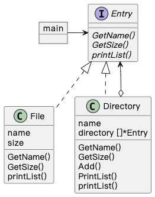

## Composite 模式

> **组合** 是一种结构型设计模式， 你可以使用它将对象组合成树状结构， 并且能像使用独立对象一样使用它们。

### 示例程序类图

1. File 类：树叶（Leaf），表示内容，不能放入其他对象。
2. Directory 类：复合物（Composite），表示容器，可以放入 Leaf 和 Composite。
3. Entry 接口：组件（Component），Leaf 和 Composite 的一致性抽象。
4. main：使用者（Client），使用组合模式。

### 拓展思路的要点

1. Composite 模式将容器和内容看成一种东西（一致性），容器可以放内容也可以放容器，创造出递归结构。

2. 多个和单个的一致性：将多个对象当做一个对象处理。
3. Add() 方法可以定义在 Entry 中，也可以定义在 Directory 中。
4. 树结构的数据结构都适用 Composite 模式。
