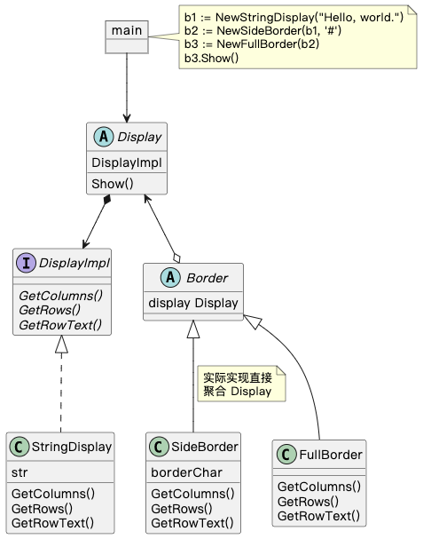

## Decorator 模式

> **装饰** 是一种结构设计模式， 允许你通过将对象放入特殊封装对象中来为原对象增加新的行为。

### 示例程序类图

1. Display 抽象类：组件（Component），定义方法。
2. StringDisplay 类：具体的组件（ConcreteComponent），实现 Component 定义的方法。
3. Border 抽象类：装饰物（Decorator），具有和 Component 相同的方法，并保存被装饰对象 Component。
4. SideBorder 类、FullBorder 类：具体的装饰物（ConcreteDecorator），实现 Decorator 的方法。

### 拓展思路的要点

1. Decorator 模式中装饰和被装饰物具有一致性，即装饰 Border 类和被装饰物 Display 类具有相同的方法，这样被装饰物被装饰，其方法也不会被隐藏。
2. 不改变被装饰物，不改变框架代码就可以新增对象增加功能。
3. 多个装饰可以组合成为新对象。
4. 缺点：使用 Decorator 模式会使程序中出现很多功能类似的小类。
