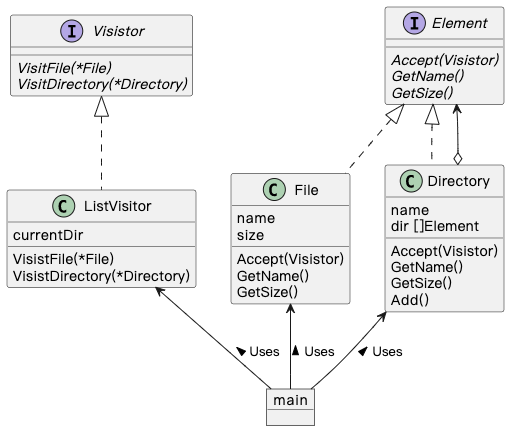
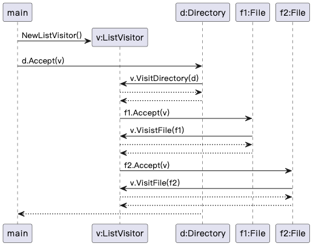

## Visitor 模式

> **访问者** 是一种行为设计模式， 允许你在不修改已有代码的情况下向已有类层次结构中增加新的行为。

### 示例程序类图

1. Visitor 接口：访问者（Visitor），为每一个 ConcreteElement 定义一个 VisitXxx() 的方法，用于处理 Xxx。
2. ListVisitor 类：具体的访问者（ConcreteVisitor），实现 Visitor 定义的方法。
3. Element 接口：元素（Element），Visitor 的访问对象，定义了接受访问者的方法 Accept()。
4. File 类、Directory 类：具体的元素（ConcreteElement），实现 Element 定义的方法。

### 示例程序时序图

当一个文件夹下有两个文件时的时序图：

### 拓展思路的要点

1. Visitor 模式中的调用关系是 element.Accept(visitor)、visitor.Visit(element)，实际处理由 ConcreteElement 和 ConcreteVisitor 共同决定，称为双重分发（double dispatch）。
2. Visitor 模式中，数据结构和处理是分离的，新增处理，不用修改数据结构（File 类和 Directory 类），符合开闭原则。
3. Visitor 模式易于增加 ConcreteVisitor：不用修改 ConcreteElement；难于增加 ConcreteElement：新增 Element 实现类 Yyy，每个 Visitor 实现类都需要新增 VisitYyy() 方法。
