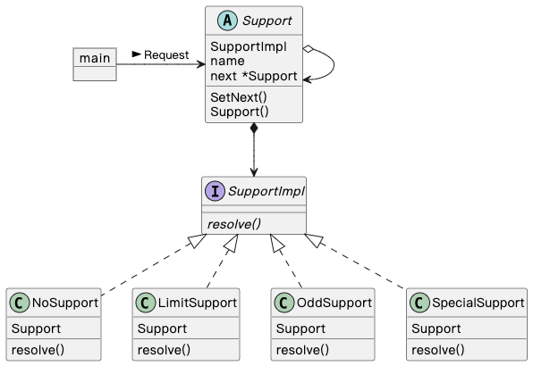
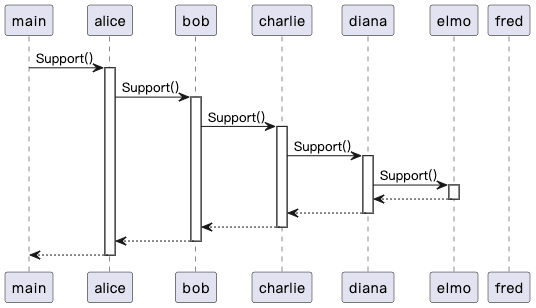

## Chain of Responsibility 模式

> **责任链** 是一种行为设计模式， 允许你将请求沿着处理者链进行发送， 直至其中一个处理者对其进行处理。

### 示例程序类图

1. Support 抽象类：处理者（Handler），定义处理请求的方法（Support()），聚合下一个处理者（next）。
2. NoSupport 类、LimitSupport 类、OddSupport 类、SpecialSupport 类：具体的处理者（ConcreteHandler），处理请求的具体实例。
3. main：请求者（Client），向第一个 ConcreteHandler 发起请求。

### 示例程序时序图

### 拓展思路的要点

1. Chain of Responsibility 模式解耦发出请求的人（Client）和处理请求的人（ConcreteHandler）。
2. Chain of Responsibility 模式，通过委托推卸责任，可以动态的改变责任链。
