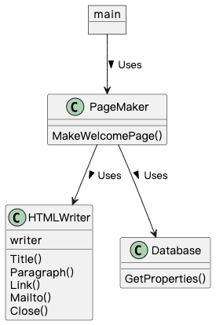

## Facade 模式

> **外观** 是一种结构型设计模式， 能为复杂系统、 程序库或框架提供一个简单 （但有限） 的接口。

### 示例程序类图

1. PageMaker 类：外观（Facade），提供高层方法。
2. HTMLWriter 类和 Database 类：复杂子系统（Subsystem），Facade 调用 Subsystem 的方法，但 Subsystem 不知道 Facade 的存在。
3. main：请求者（Client），使用 Facade。

### 拓展思路的要点

1. Facade 模式减少程序的方法，弱化了程序与外部的关联，使程序更容易被复用。
2. 递归地使用 Facade 模式：整合多个 Facade 类，引入新的 Facade。
