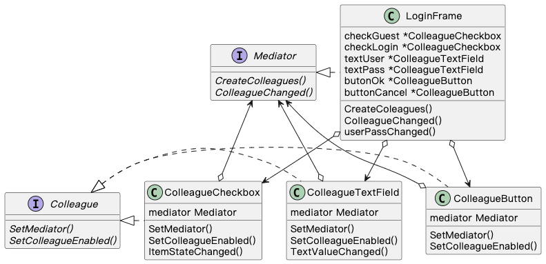
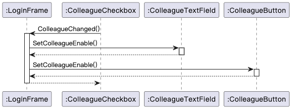

## Mediator 模式

> **中介者** 是一种行为设计模式， 让程序组件通过特殊的中介者对象进行间接沟通， 达到减少组件之间依赖关系的目的。

### 示例程序类图

1. Mediator 接口：中介者（Mediator），定义与 Colleague 交互的方法。
2. LoginFrame 类：具体的中介者（ConcreteMediator），实现 Mediator 定义的方法。
3. Colleague 接口：同事（Colleague），定义与 Mediator 交互的方法。
4. ColleagueCheckbox 类、ColleagueTextField 类、ColleagueButton 类：具体的同事（ConcreteColleague），实现 Colleague 定义的方法。

### 示例程序时序图

最终决定都由中介者（LoginFrame）的 ColleagueChanged() 方法下达。

### 拓展思路的要点

1. 当调整多个对象的关系时，可以使用 Mediator 模式，将逻辑处理统一交给中介者，减少实例通信线路，方便调试和修改。
2. ConcreteColleague 可以复用，ConcreteMediator 很难复用（因为依赖于特定应用程序）。
