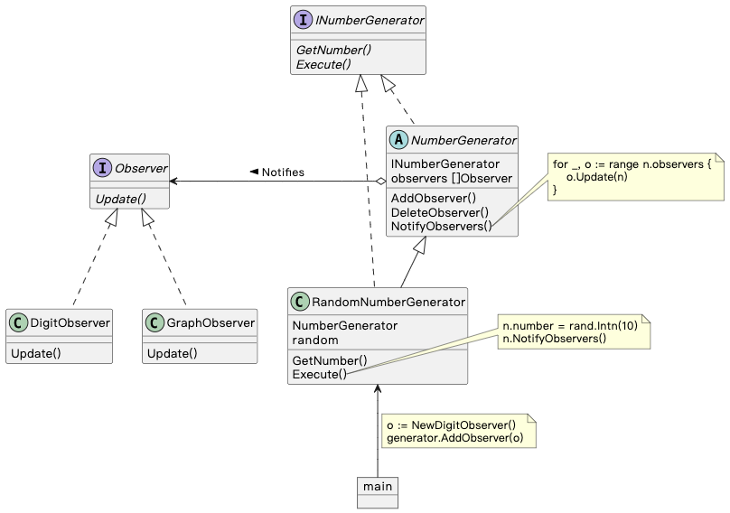

## Observer 模式

> **观察者** 是一种行为设计模式， 允许一个对象将其状态的改变通知其他对象

### 示例程序类图

1. NumberGenerator 抽象类：观察对象（Subject），实现注册、删除和通知观察者的方法，并定义获取 “状态” 的方法。
2. RandomNumberGenerator 类：具体的观察对象（ConcreteSubject），实现 Subject 定义的方法。
3. Observer 接口：观察者（Observer），定义接收 Subject 通知的方法。
4. DigitObserver 类、GraphObserver 类：具体的观察者（ConcreteObserver），实现 Observer 定义的方法。

### 拓展思路的要点

1. ConcreteSubject 不依赖具体的 Observer，ConcreteObserver 不依赖具体的 Subject，都可替换。
2. observers 中各个 Observer.Update() 调用顺序不影响结果。
3. Observer 触发 Subject 调用 Update() 会导致循环调用。
4. Update() 的入参可以是 Subject，也可以是数据。
5. Observer 模式也被称为 Publish-Subscribe（发布-订阅）模式。
