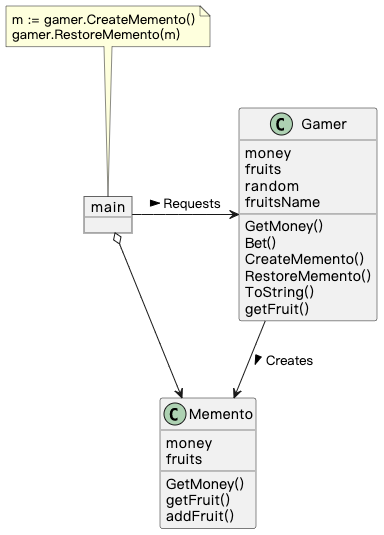
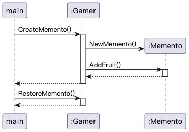

## Memento 模式

> **备忘录** 是一种行为设计模式， 允许生成对象状态的快照并在以后将其还原。

### 示例程序类图

1. Gamer 类：原发器（Originator），实现生成最新状态快照的 CreateMemento() 和从快照中恢复状态的 RestoreMemento() 方法。

2. Memento 类：备忘录（Memento），存储 Originator 状态的快照。

3. main：负责人（Caretaker），使用 Gamer，保存 Memento。

   

### 示例程序时序图

### 拓展思路的要点

- 为了防止破坏对象的封装性，Memento 提供了两种接口。
  - 宽接口：暴露 Memento 中所有的信息，只能由 Originator 使用，用于恢复 Originator 的状态。
  - 窄接口：暴露 Memento 中部分的信息，提供给 Caretaker 使用。

- 保存多个 Memento，可以存储不同时间点的 Originator 状态。
- Memento 有效期：应用程序升级后，之前 Memento 可能不可用。
