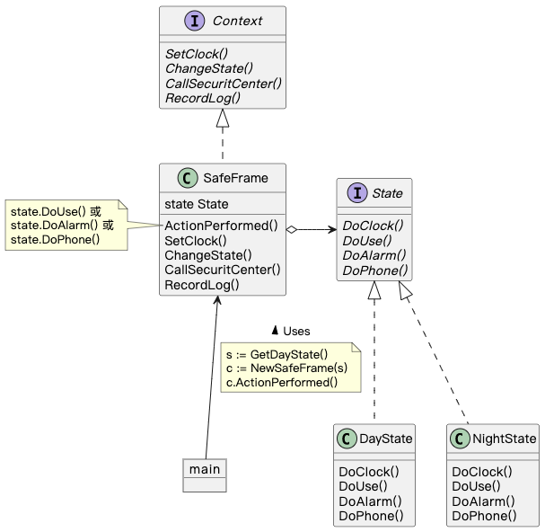
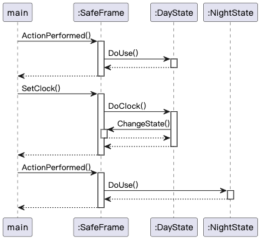

## State 模式

> **状态** 是一种行为设计模式， 让你能在一个对象的内部状态变化时改变其行为。

### 示例程序类图

1. State 接口：状态（State），定义根据状态进行处理的方法。
2. DayState 类、NightState 类：具体的状态（ConcreteState），实现 State 定义的方法。
3. Context 接口：上下文（Context），定义使用 State 模式的方法。
4. SafeFrame 类：具体的上下文（ConcreteContext），实现 Context 定义的方法，并持有当前状态 ConcreteState。

### 示例程序时序图

状态改变前后 DoUse() 流程不同。

### 拓展思路的要点

1. 分而治之：用类表示状态，将依赖状态的处理拆分到不同 ConcreteState 中，以此拆解复杂程序。
2. 由 ConcreteState 进行状态转移
   - 优点：从某个状态转移到其他状态的逻辑集中在一个 ConcreteState 中，方便阅读。
   - 缺点：每个 ConcreteState 都要知道其他 ConcreteState，增加了类之间的依赖关系。
3. 易于增加新状态：实现 State 接口即可；不易增加依赖状态的处理：State 接口新增方法，每个 ConcreteState 都需要实现。
