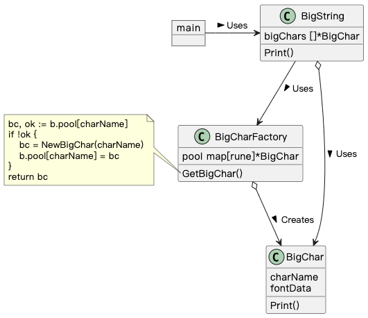

## Flyweight 模式

> **享元** 是一种结构型设计模式， 它允许你在消耗少量内存的情况下支持大量对象。

### 示例程序类图

1. BigChar 类：享元（Flyweight），共享实例的类。
2. BigCharFactory 类：享元工厂（FlyweightFactory），生成 Flyweight 共享实例的工厂。
3. BigString 类：请求者（Client），使用 FlyweightFactory 生成 Flyweight。

### 拓展思路的要点

1. 共享实例或共享不同实例的相同数据，可以节省内存及生成实例的时间。

   - 应当共享的信息：Intrinsic 信息，不会改变或不依赖实例状态的信息，如 BigChar.fontData。

   - 不应当共享的信息：Extrinsic 信息，会改变或依赖实例状态的信息，如 BigString.bigChars。

2. 共享的特点：改变共享对象，会影响多个地方。
