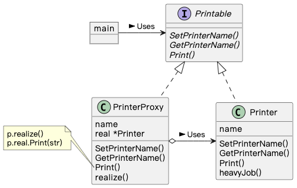
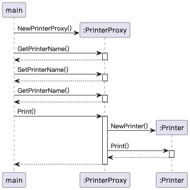

## Proxy 模式

> **代理** 是一种结构型设计模式， 让你能提供真实服务对象的替代品给客户端使用。 代理接收客户端的请求并进行一些处理 （访问控制和缓存等）， 然后再将请求传递给服务对象。

### 示例程序类图

1. Printable 接口：主体（Subject），使 Proxy 和 RealSubject 一致性的接口。
2. PrinterProxy 类：代理人（Proxy），实现 Subject 定义的方法，只在必要时创建或使用 RealSubject。
3. Printer 类：实际的主体（RealSubject），实现 Subject 定义的方法。
4. main：请求者（Client），使用 Proxy 模式。

### 示例程序时序图

### 拓展思路的要点

1. 使用代理人将耗时处理推迟，提升速度。
2. 划分代理人（PrinterProxy）和本人（Printer），分而治之，方便修改和替换。
   - 修改：对 “代理人和本人负责处理的划分” 进行更改，不必修改 Printer。
   - 替换：PrinterProxy 具有透明性（和 Printer 都实现了 Printable），main 可以切换这两个类。
