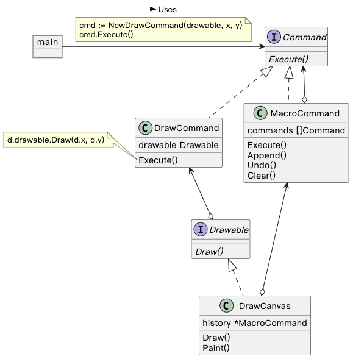
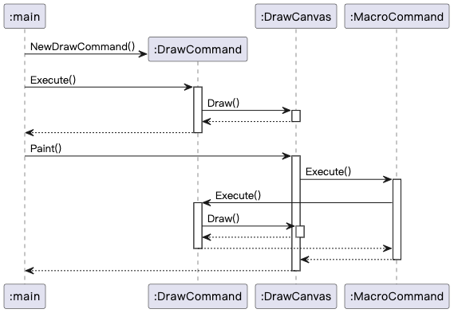

## Command 模式

> **命令** 是一种行为设计模式， 它可将请求或简单操作转换为一个对象。

### 示例程序类图

1. Command 接口：命令（Command），定义命令方法。
2. DrawCommand 类、MacroCommand 类：具体的命令（ConcreteCommand），实现 Command 定义的方法。
3. DrawCanvas 类：接收者（Receiver），Command 执行命令的对象。
4. main：请求者（Client），生成 ConcreteCommand 并分配给 Receiver。
5. main：发动者（Invoker），调用定义的命令方法。

### 示例程序时序图

### 拓展思路的要点

1. 命令的目的不同，应该包含的信息也不同。
2. 执行过的命令可以保存为历史记录。