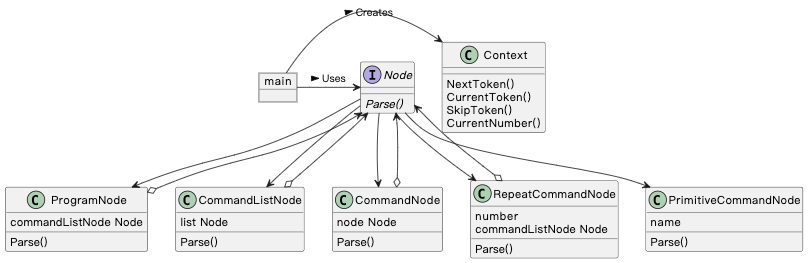

## Interpreter 模式

> **解释器** 是一种行为设计模式，它定义一套 “迷你语言”，并设计该语言的解释器，解释并运行 “迷你语言” 编写的 “迷你程序”。

### 示例程序类图

1. Node 接口：抽象表达式（AbstractExpression），定义语法树节点的方法。
2. PrimitiveCommandNode 类：终结符表达式（TerminalExpression），实现 Node 定义的方法，对应 BNF 中的终结符表达式。
3. ProgramCommandNode 类、CommandListNode 类、CommandNode 类、RepeatCommadNode 类：非终结符表达式（NonterminalExpression），实现 Node 定义的方法，对应 BNF 中的非终结符表达式。
4. Context 类：上下文（Context），为解释器提供信息。
5. main：请求者（Client），使用解释器模式。

### 拓展思路的要点

1. 问题变化修改时，只需改动 “迷你语言” 编写的 “迷你程序”。
2. 其他迷你语言：正则表达式、检索表达式、批处理语言（示例迷你语言）。