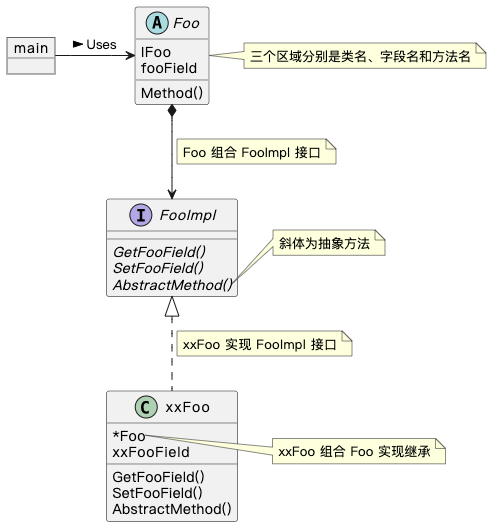
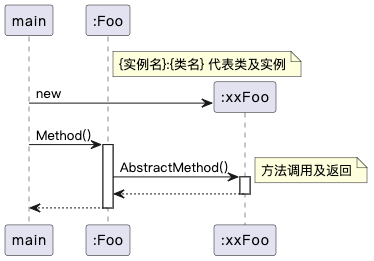

## Tutorial

Golang 通过结构体（Foo）匿名组合（FooImpl）接口来实现抽象类，由于接口中不能包含字段，所以只能通过 Get()、Set() 方法（GetFooField()、SetFooField()）来操作抽象类中的字段。

抽象类（Foo）声明的抽象方法（AbstractMethod()），具体由子类（xxFoo）实现。

具体使用参考[示例代码](./main.go)，下面是代码类图和时序图。

#### 类图

类图用于表示类、接口、实例等之间的静态关系。



#### 时序图

时序图用于表示程序内方法的调用顺序。



注：

1. 抽象类中的字段使用：

   - 如果仅在抽象类中使用，则只需要初始化在抽象类中。

     ```go
     foo := &Foo{
     		FooImpl:  &xxFoo{
     			xxFooField: "origin xx foo",
     		},
     		fooField: "origin foo", // there
     }
     ```

   - 如果需要在子类中使用，则需要 FooImpl 接口中声明 GetFooField()、SetFooField() 方法，供抽象类使用，并在子类中初始化，供子类使用。

     ```go
     foo := &Foo{
     		FooImpl: &xxFoo{
     			Foo: &Foo{
     				fooField: "origin foo", // there
     			},
     			xxFooField: "origin xx foo",
     		},
     }
     ```

2. 本 repo 中的 UML 都是使用 [PlantUML](https://plantuml.com/) 编写的，示例 [类图](./class.puml)、[时序图](./sequence.puml)。

3. 聚合和组合的区别：聚合体现 has a 关系，组合体现 contains a 关系。