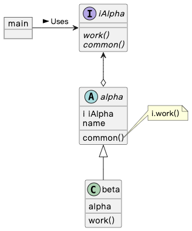

## Tutorial

### 代码

Golang 通过结构体（abstract concrete type）组合接口（abstract interface）来实现抽象类，具体代码如下：

```go
package main

import "fmt"

// Abstract Interface
type iAlpha interface {
	work()
	common()
}

// Abstract Concrete Type
type alpha struct {
	i    iAlpha
	name string
}

func (a *alpha) common() {
	fmt.Println("common called")
	a.i.work()
}

// Implementing Type
type beta struct {
	alpha
}

func newBeta(name string) iAlpha {
	b := new(beta)
	b.name = name
	// i 为 iAlpha，接口赋值指向具体子类对象，来调用子类实现的方法
	b.i = b
	return b
}

func (b *beta) work() {
	fmt.Println("work called")
	fmt.Printf("Name is %s\n", b.name)
}

func main() {
	b := newBeta("test")
	b.common()
}

```

输出：

```go
common called
work called
Name is test
```

结构体 alpha 中所有未定义的方法，都会调用其接口类型参数 iAlpha 中的默认方法。

### 类图

类图用于表示类、接口、实例等之间的静态关系。



### 注意

1. 本 repo 中的 UML 都是使用 [PlantUML](https://plantuml.com/) 编写的，示例 [类图](./class.puml)。

2. 聚合和组合的区别：聚合体现 has a 关系，组合体现 contains a 关系。

### 感谢

- [Abstract Class in GO: Complete Guide](https://golangbyexample.com/go-abstract-class/)

- [Abstract Class reinvented](https://adrianwit.medium.com/abstract-class-reinvented-with-go-4a7326525034)
- [模板方法模式](https://www.yuque.com/aceld/lfhu8y/pwepxk)